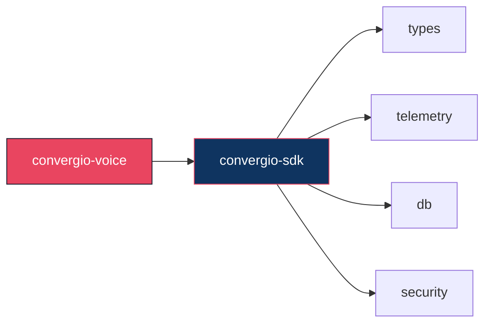

# convergio-voice

[](https://github.com/Roberdan/convergio-voice/actions/workflows/ci.yml)
[](https://github.com/Roberdan/convergio-voice/blob/main/LICENSE)
[](https://www.rust-lang.org/)
[](#)

STT/TTS engine — standalone audio processing for Convergio

Part of the [Convergio](https://github.com/Roberdan/convergio) ecosystem.

## Architecture



## Quality gates

| Gate | Tool | Enforced |
|------|------|----------|
| Zero warnings | `RUSTFLAGS="-Dwarnings"` | CI blocks merge |
| All tests pass | `cargo test --locked` | CI blocks merge |
| Coverage ≥70% | `cargo tarpaulin --fail-under 70` | CI blocks merge |
| Dependency audit (CVE) | `cargo audit` | CI blocks merge |
| License + deps policy | `cargo deny check` | CI blocks merge |
| Semver compatibility | `cargo semver-checks` | CI blocks merge (PR) |
| Unused dependencies | `cargo udeps` | CI blocks merge |
| Conventional commits | PR title lint | CI blocks merge (PR) |
| Format | `cargo fmt --check` | CI blocks merge |
| SBOM (CycloneDX) | `cargo cyclonedx` | On release |
| Auto-release | release-please + PAT | Fully automatic |

## Usage

```toml
[dependencies]
convergio-voice = { git = "https://github.com/Roberdan/convergio-voice", tag = "v0.1.0" }
```

## Development

```bash
cargo fmt --all -- --check
RUSTFLAGS="-Dwarnings" cargo clippy --workspace --all-targets --locked
cargo test --workspace --locked
cargo deny check
```

## Related

- [convergio-sdk](https://github.com/Roberdan/convergio-sdk) — Core types, telemetry, security, db
- [convergio](https://github.com/Roberdan/convergio) — Main daemon

## License

Convergio Community License v1.3 — see [LICENSE](LICENSE).

---

## The Agentic Manifesto

> Canonical source: [AgenticManifesto.md](https://github.com/Roberdan/convergio/blob/main/AgenticManifesto.md)

*Human purpose. AI momentum.*
Milano — 23 June 2025

**What we believe**
1. **Intent is human, momentum is agent.**
2. **Impact must reach every mind and body.**
3. **Trust grows from transparent provenance.**
4. **Progress is judged by outcomes, not output.**

**How we act**
1. **Humans stay accountable for decisions and effects.**
2. **Agents amplify capability, never identity.**
3. **We design from the edge first: disability, language, connectivity.**
4. **Safety rails precede scale.**
5. **Learn in small loops, ship value early.**
6. **Bias is a bug—we detect, test, and fix continuously.**

*Signed in Milano, 23 June 2025 — Roberto D'Angelo · Claude · ChatGPT*

*Made with love for Mario in Milano, Italy, Europe.*

---

© 2025-present Roberto D'Angelo. All rights reserved.
